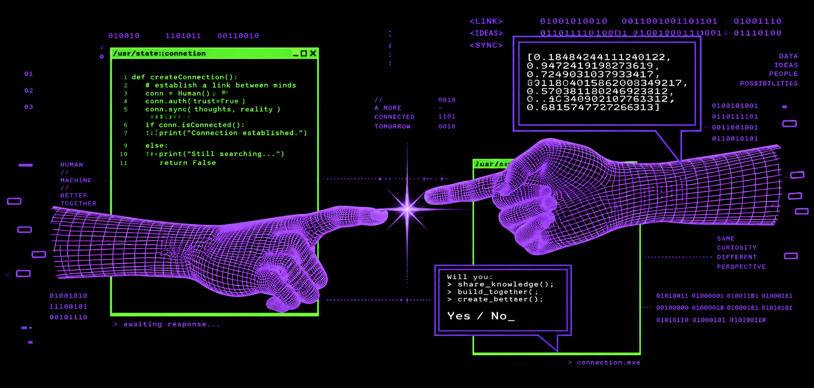

<h1 align="center">Hey  I'm Lara Andrade</h1>
<h3 align="center">Fullstack Developer</h3>

  

## 📌 About Me
- 👋 Hi, I'm Lara, a Fullstack Developer passionate about building clean, functional and meaningful web experiences. I enjoy working across both frontend and backend, exploring new technologies and continuously improving my skills through real-world projects.
- 🔐 Currently, I'm focused on growing as a developer, building personal projects and expanding my knowledge in Cybersecurity, while learning more about software architecture and modern web development.
- 🧩 I enjoy understanding how things work under the hood, experimenting with new ideas and constantly challenging myself to learn something new.

## 🧠 My Focus Areas
- 💻 Fullstack Development
- 🔐 Cybersecurity
- 🏗️ Software Architecture

## 📊 GitHub Stats & Trophies

  
  

  

  

  

## 🛠️ Languages & Tools

<h3 align="center">Programming Languages</h3>

  &nbsp;&nbsp;
  &nbsp;&nbsp;
  

<h3 align="center">Frontend</h3>

  &nbsp;&nbsp;
  &nbsp;&nbsp;
  

<h3 align="center">Backend</h3>

  &nbsp;&nbsp;
  

<h3 align="center">Database</h3>

  &nbsp;&nbsp;
  

<h3 align="center">Tools</h3>

  &nbsp;&nbsp;
  &nbsp;&nbsp;
  

  

 

## 🔗 Connect with Me

  &nbsp;&nbsp;
  

<picture>
  <source media="(prefers-color-scheme: dark)" srcset="https://raw.githubusercontent.com/tobiasmeyhoefer/tobiasmeyhoefer/output/github-snake-dark.svg" />
  <source media="(prefers-color-scheme: light)" srcset="https://raw.githubusercontent.com/tobiasmeyhoefer/tobiasmeyhoefer/output/github-snake.svg" />
  
</picture>

  

